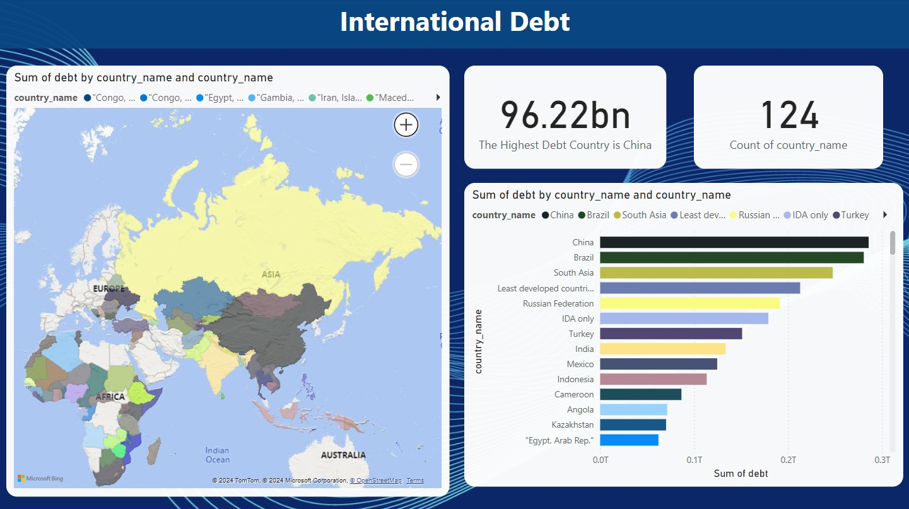

# Analysis-of-International-Debt-Country-Rankings-and-Specific-Insights

### Project Overview
In this project, I analyze international debt data collected by The World Bank. The dataset contains information about the amount of debt (in USD) owed by developing countries across several categories. I clean the data using Jupyter Notebook and display data visualizations. I created a map dashboard out of it using the Power BI.

